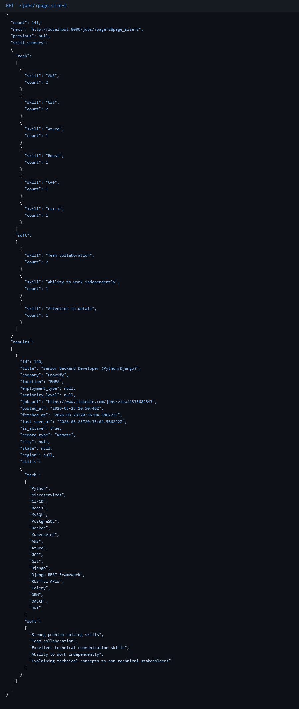
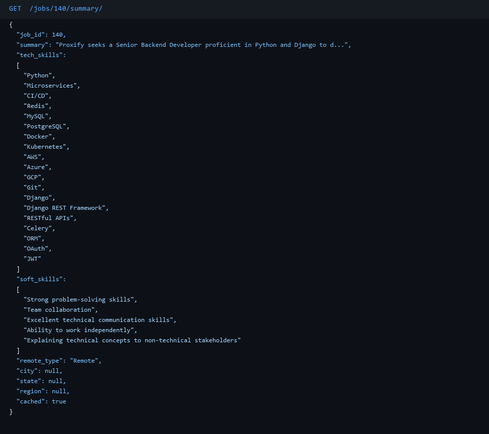
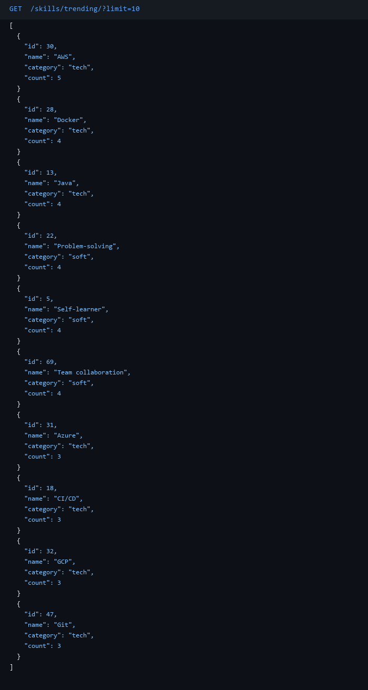

# Job Targeting API

A Django REST API for targeting and analyzing job postings. Automatically collects listings via RapidAPI, runs them through an AI pipeline (Claude / OpenAI / Gemini) to extract structured data — skills, location, work arrangement — and serves the results through a queryable REST interface. Supports full-text search with relevance ranking, location filtering, skill trend analysis, and async background processing — all containerized with Docker.

## Features

- **Automatic job fetching** — Celery Beat pulls fresh jobs every 6 hours using `.env` defaults
- **Flexible manual fetch** — `POST /jobs/fetch/?query=Java+Developer&location=Tel+Aviv` overrides query and location on demand
- **AI summarisation** — Claude (default), OpenAI, or Gemini extract a structured summary, tech skills, soft skills, work arrangement (Remote/Hybrid/On-site), city, state, and region from each job posting
- **Bulk summarisation** — `POST /jobs/summarize-bulk/?limit=20` kicks off a background Celery task, returns 202 immediately, poll `GET /jobs/tasks/{id}/` for progress
- **Three-layer summary cache** — Redis hot-cache → Postgres permanent store → AI call (AI called only once per job, ever)
- **Skill trend tracking** — every summarisation upserts skills; trending counts computed via live COUNT query on JobSkill
- **Ordering, filtering & search** — sort by posted/fetch/last_seen date; filter by city/state/region; free-text search with relevance ranking across title, description, and skills
- **Skill summary in list** — every `GET /jobs/` response includes a `skill_summary` with tech and soft skill counts for the current page
- **Fully containerised** — one `docker compose up --build` starts everything

---

## Preview

**Job list — paginated response with `skill_summary`**


**AI-generated structured summary**


**Trending skills**


---

## Works for Any Job Domain

This template is not specific to tech jobs. Two lines in `.env` control what gets fetched:

```bash
JOB_SEARCH_QUERY=Python Backend Developer
JOB_SEARCH_LOCATION=Israel
```

Change them to target any role or location — no code changes needed:

| Query | Location | Use case |
|---|---|---|
| `Registered Nurse` | `London` | Healthcare jobs in the UK |
| `Marketing Manager` | `New York` | Marketing roles in the US |
| `DevOps Engineer` | `Germany` | DevOps market in Germany |
| `Data Scientist` | `Remote` | Remote-only data science roles |
| `Financial Analyst` | `Singapore` | Finance jobs in Southeast Asia |

The AI summarizer, skill extractor, caching layer, and all API endpoints work identically regardless of domain.

---

## Quick Start

### 1. Clone and configure

```bash
git clone https://github.com/YOUR_USERNAME/YOUR_REPO_NAME.git
cd YOUR_REPO_NAME
cp .env.example .env
```

Open `.env` and fill in your keys (see [Environment Variables](#environment-variables) below).

### 2. Build scripts

Two helper scripts cover every common task — no extra tools required, just Docker:

| Platform | Script | Example |
|---|---|---|
| Mac / Linux | `build.sh` | `./build.sh test` |
| Windows | `build.bat` | `build.bat test` |

```
setup         → copy .env.example to .env
build         → build all Docker images
test          → run full pytest suite (49 tests)
test-rebuild  → force rebuild image then run tests
up            → start API + DB + Redis in background
up-full       → start full stack incl. Celery worker + Beat
down          → stop all containers
logs          → tail logs for all services
smoke         → run live endpoint smoke test (server must be up)
clean         → remove containers, volumes, and images
```

### 3. Start the full stack

```bash
# Mac / Linux
./build.sh up-full

# Windows
build.bat up-full
```

This starts:
- Django API on `http://localhost:8000`
- Celery worker (executes fetch tasks)
- Celery Beat (fires fetch every 6 hours)
- PostgreSQL
- Redis

### 4. Fetch your first jobs

```bash
curl -X POST http://localhost:8000/jobs/fetch/
```

### 5. Browse jobs

```bash
curl http://localhost:8000/jobs/
curl http://localhost:8000/jobs/1/
curl http://localhost:8000/jobs/1/summary/
curl http://localhost:8000/skills/trending/
```

### 6. Browse data in the browser

**Django Admin** — full table UI to view and inspect every row:
```
http://localhost:8000/admin/
username: admin
password: admin123
```

Browse all job posts, filter by `remote_type` or `is_active`, search by company or title, and see the full AI summary and linked skills for any job — all from your browser.

> To create your own admin user: `docker compose exec web python manage.py createsuperuser`

**DRF Browsable API** — click through all endpoints in HTML:
```
http://localhost:8000/jobs/
```

---

## API Endpoints

| Method | URL | Description |
|---|---|---|
| `GET` | `/jobs/` | Paginated job list + skill_summary |
| `GET` | `/jobs/?page_size=10` | Override page size (default 20, max 100) |
| `GET` | `/jobs/?ordering=-posted_at` | Sort by field |
| `GET` | `/jobs/?search=python` | Free-text search (title, description, skills) |
| `GET` | `/jobs/?search=python&city=Tel+Aviv` | Search + location filter combined |
| `GET` | `/jobs/?city=Tel+Aviv` | Filter by city (case-insensitive) |
| `GET` | `/jobs/?state=Tel+Aviv+District` | Filter by state/district |
| `GET` | `/jobs/?region=Center` | Filter by region |
| `GET` | `/jobs/?city=Tel+Aviv&region=Center` | Combine location filters |
| `GET` | `/jobs/{id}/` | Full job detail + skills |
| `GET` | `/jobs/{id}/summary/` | AI-generated structured summary |
| `POST` | `/jobs/fetch/` | Fetch jobs (uses .env defaults) |
| `POST` | `/jobs/fetch/?query=Java+Developer&location=Tel+Aviv` | Fetch with custom query/location |
| `POST` | `/jobs/summarize-bulk/` | Summarize unsummarized jobs in background (202 + task_id) |
| `POST` | `/jobs/summarize-bulk/?limit=25&locations=Tel+Aviv,Haifa&search=python,django` | With filters |
| `GET` | `/jobs/tasks/{task_id}/` | Poll bulk summarization progress |
| `GET` | `/skills/trending/` | Skills ranked by usage count |
| `GET` | `/skills/trending/?limit=5` | Top N skills |
| `GET` | `/health/` | Health check |

### Ordering options

```
?ordering=-fetched_at     newest scraped first (default)
?ordering=-posted_at      newest posted first
?ordering=-last_seen_at   most recently seen in API
?ordering=title           alphabetical
?ordering=company         by company name
```

### Free-text search

```
?search=python
?search=python+backend
```

Searches across **title**, **description**, and **skills** simultaneously. Results ranked by relevance:
1. Title match → top
2. Skill match → middle
3. Description-only match → bottom

Combinable with location filters and pagination: `?search=python&city=Tel+Aviv&page_size=10`

### Location filtering

```
?city=Tel+Aviv
?state=Tel+Aviv+District
?region=Center
?city=Tel+Aviv&region=Center
```

All location filters are case-insensitive and can be combined with ordering, search, and pagination.

### Example responses

**`GET /jobs/`**
```json
{
  "count": 100,
  "next": "http://localhost:8000/jobs/?page=2",
  "previous": null,
  "skill_summary": {
    "tech": [{"skill": "Python", "count": 42}, {"skill": "Django", "count": 35}],
    "soft": [{"skill": "Team player", "count": 18}]
  },
  "results": [
    {
      "id": 1,
      "title": "Python Backend Developer",
      "company": "Acme Ltd",
      "location": "Tel Aviv, Israel",
      "description": "We are looking for...",
      "employment_type": "Full-time",
      "seniority_level": "Mid-Senior",
      "job_url": "https://linkedin.com/jobs/...",
      "posted_at": "2026-03-15T10:00:00Z",
      "fetched_at": "2026-03-22T08:00:00Z",
      "last_seen_at": "2026-03-22T08:00:00Z",
      "is_active": true,
      "remote_type": "Hybrid",
      "city": "Tel Aviv",
      "state": "Tel Aviv District",
      "region": "Center",
      "skills": {"tech": ["Python", "Django"], "soft": ["Team player"]}
    }
  ]
}
```

**`GET /jobs/1/summary/`**
```json
{
  "job_id": 1,
  "summary": "Senior backend role focused on Python and Django at a product company...",
  "tech_skills": ["Python", "Django", "PostgreSQL", "Redis", "Docker"],
  "soft_skills": ["Team player", "Self-starter", "Strong communication"],
  "remote_type": "Hybrid",
  "city": "Tel Aviv",
  "state": "Tel Aviv District",
  "region": "Center",
  "cached": false
}
```

**`GET /skills/trending/?limit=5`**
```json
[
  {"id": 1, "name": "Python",     "category": "tech", "count": 87},
  {"id": 2, "name": "Django",     "category": "tech", "count": 64},
  {"id": 3, "name": "PostgreSQL", "category": "tech", "count": 41},
  {"id": 4, "name": "Docker",     "category": "tech", "count": 38},
  {"id": 5, "name": "Redis",      "category": "tech", "count": 29}
]
```

---

## Environment Variables

Copy `.env.example` to `.env` and fill in:

| Variable | Required | Description |
|---|---|---|
| `AI_PROVIDER` | No (default: `claude`) | `claude` / `openai` / `gemini` |
| `ANTHROPIC_API_KEY` | If `AI_PROVIDER=claude` | [console.anthropic.com](https://console.anthropic.com) |
| `OPENAI_API_KEY` | If `AI_PROVIDER=openai` | [platform.openai.com](https://platform.openai.com) |
| `GEMINI_API_KEY` | If `AI_PROVIDER=gemini` | [aistudio.google.com](https://aistudio.google.com) |
| `RAPIDAPI_KEY` | **Yes** | [rapidapi.com](https://rapidapi.com) — used for job fetching |
| `JOB_API_PROVIDER` | No (default: `linkedin`) | `linkedin` / `jsearch` |
| `DATABASE_URL` | **Yes** | PostgreSQL connection string |
| `REDIS_URL` | **Yes** | Redis connection string |
| `SUMMARY_CACHE_TTL` | No (default: `3600`) | Summary cache TTL in seconds |

> **Note**: `DATABASE_URL` and `REDIS_URL` are pre-filled in `.env.example` for local Docker use. You only need to supply API keys.

---

## Switching AI Provider

Edit one line in `.env` — no code changes needed:

```bash
AI_PROVIDER=claude   # or openai or gemini
```

---

## Architecture

```
┌─────────────────────────────────────────────────────────────┐
│  Docker Compose                                             │
│                                                             │
│  web (Django + Gunicorn :8000)                              │
│    └─ GET /jobs/{id}/summary/                               │
│         1. Redis cache hit? → return                        │
│         2. Postgres has ai_summary? → re-warm Redis, return │
│         3. Call AI → save both → return                     │
│                                                             │
│  celery_beat ──every 6h──▶ Redis queue                      │
│  celery_worker ──────────▶ fetch_and_store()                │
│                             └─ LinkedIn/JSearch API         │
│                             └─ Postgres upsert              │
│                                                             │
│  db (PostgreSQL)    redis (Celery broker + summary cache)   │
└─────────────────────────────────────────────────────────────┘
```

### Docker images

| Image | Dockerfile | Deps installed |
|---|---|---|
| `web` | `Dockerfile.web` | `requirements.txt` (prod only) |
| `celery_worker` | `Dockerfile.worker` | `requirements.txt` (prod only) |
| `celery_beat` | `Dockerfile.beat` | `requirements.txt` (prod only) |
| `test` | `Dockerfile.test` | `requirements-dev.txt` (prod + pytest) |

---

## Running Tests

### Unit / integration tests (pytest — no server needed)

```bash
# Mac / Linux
./build.sh test

# Windows
build.bat test

# Or directly
docker compose --profile test run --rm test
```

Force rebuild first (after dependency changes):
```bash
./build.sh test-rebuild
```

49 tests covering:
- Job list, pagination, ordering, location filters, free-text search with relevance ranking
- Job detail with skills separated by category (tech/soft)
- Summary cache — all three layers (Redis, Postgres, AI)
- Fetch endpoint with custom query/location overrides
- Bulk summarization — 202 response, filters, task status polling
- Skill trending and limit param
- `last_seen_at` stamp on existing jobs

### Live smoke test (hits real running server)

Starts the stack first, then runs `scripts/smoke_test.py` against every endpoint.
Writes full JSON responses to `smoke_results.json` (gitignored).

```bash
./build.sh up-full        # start the stack
./build.sh smoke          # run smoke test → smoke_results.json
```

---

## Tech Stack

| Layer | Technology |
|---|---|
| API framework | Django 4.2 + Django REST Framework 3.15 |
| Database | PostgreSQL 16 |
| Cache / broker | Redis 7 |
| Task queue | Celery 5.3 + Celery Beat |
| AI providers | Anthropic Claude, OpenAI, Google Gemini |
| HTTP client | httpx |
| Container | Docker + Docker Compose |
| Testing | pytest + pytest-django |
